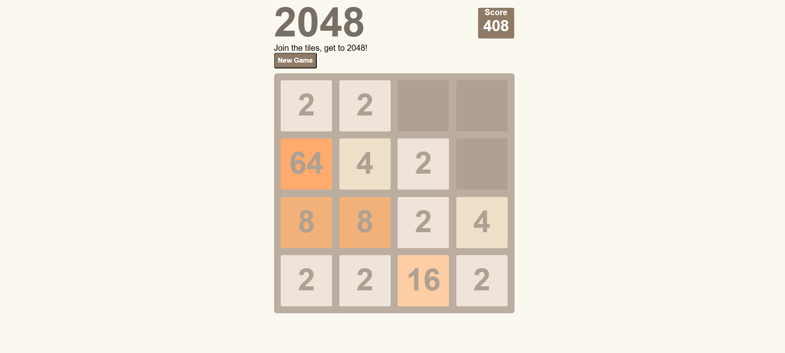

# 2048
This is a fully functional 2048 Game built using HTML, CSS, and JavaScript. The game is a clone of the popular puzzle game where players combine numbered tiles to reach the 2048 tile.

Features:
- Interactive Gameplay: Combine tiles with the same number by moving them in four directions (up, down, left, right).
- Score Tracking: The current score is displayed and updates as tiles are combined.
- Win/Lose Conditions: The game ends when the player reaches the 2048 tile (win) or when the board is full with no valid moves (lose).
- Responsive Design: The game is designed to work seamlessly on both desktop and mobile devices.
 Restart Option: Players can restart the game at any time to try again.

Technologies Used:
HTML: For structuring the game board and tiles.
CSS: For styling the game interface, including animations and transitions.
JavaScript: For implementing game logic, handling user input, and updating the DOM dynamically.

How to Play:
- Use the arrow keys (or swipe on mobile) to move the tiles.
- Combine tiles with the same number to create a new tile with the sum of the two.
- Continue combining tiles until you reach the 2048 tile or the board is full.

How to Run:
1- Clone the repository.
2- Open the index.html file in your browser.
3- Start playing!
